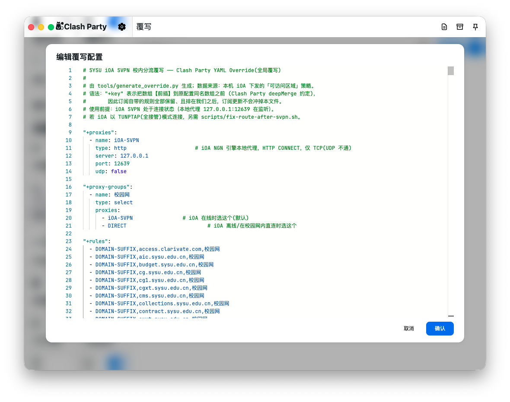
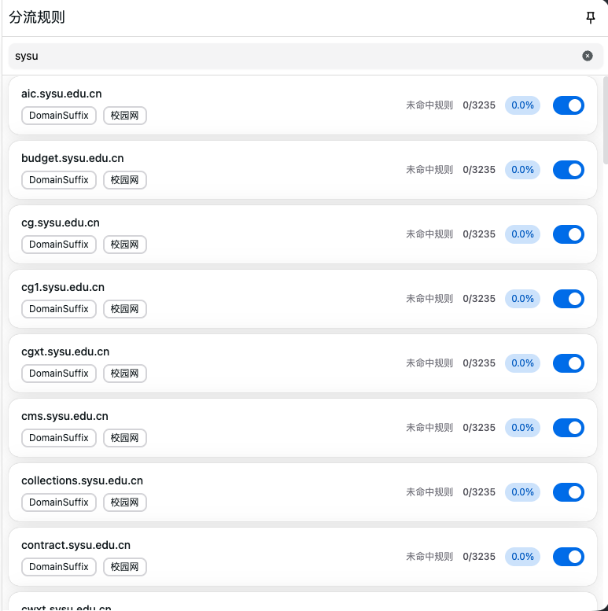

# SYSU-SVPN-coexist


**腾讯 iOA 零信任 SVPN 与 Clash 系代理（Clash Party / Clash Verge Rev，TUN 模式）在 macOS 上的共存方案。**

一句话原理：iOA 的 SVPN 引擎连接后会一直在本机监听一个 HTTP 代理端口（默认 `127.0.0.1:12639`），
校内流量的放行清单（域名/IP + 端口）在引擎侧校验——所以**不需要让 iOA 抢占路由**，
把校内网段的流量通过覆写规则"链"到这个本地代理即可；Clash TUN 继续接管其余全部流量。

```
浏览器/CLI ──► Clash TUN(mihomo) ──┬── 校内域名/网段 ──► iOA-SVPN(127.0.0.1:12639) ──► iOA 隧道 ──► 校内
                                  └── 其余流量 ────────► 代理节点 ─────────────────► 外网
```

## 特性

- ✅ iOA 与 Clash TUN 同时在线：外网 200，校内 SSH/Web/数据库全通
- ✅ 规则放进**覆写层**（Clash Party global override / Verge Rev 全局扩展配置），订阅更新不丢失
- ✅ 覆写文件由脚本从 iOA 下发的「可访问区域」策略自动生成，换学校可复用
- ✅ 附 TUNPTAP 全接管模式下的默认路由修复脚本与完整排障手册
- ✅ 内置中山大学（SYSU）资源清单的现成覆写（84 域名 + 约 3800 条数据库网段）

## 快速开始（SYSU 用户）

1. 连接 iOA SVPN；
2. Clash Party：「覆写」→ 新建 YAML → 粘贴 [`overrides/sysu-ioa-svpn.yaml`](overrides/sysu-ioa-svpn.yaml) → 在订阅（或全局）启用 → 重启核心；
   Verge Rev 用户：全局扩展配置里用 Script 方式粘贴 [`overrides/sysu-ioa-svpn.js`](overrides/sysu-ioa-svpn.js)；
3. 「校园网」组保持 `iOA-SVPN`，验证：

```bash
curl -s -o /dev/null -w '%{http_code}\n' https://www.google.com   # 200（走代理节点）
ssh <你的校内主机>                                                 # 正常登录（走 iOA 隧道）
```

其它学校：按 [docs/usage.md](docs/usage.md) 第 1-2 步提取并生成你自己学校的覆写。

## 文档

| 文档 | 内容 |
|---|---|
| [docs/research.md](docs/research.md) | SVPN 隧道机制逆向：组件、端口、三种接入模式、接管时序、策略结构、冲突根因、方法论 |
| [docs/usage.md](docs/usage.md) | 提取清单 → 生成覆写 → 导入 Party/Verge → 验证 → 日常使用与卸载 |
| [docs/troubleshooting.md](docs/troubleshooting.md) | 12 类症状速查：节点全挂、ssh Connection closed、特定端口超时、DNS、覆写不生效…… |

## 目录结构

```
SYSU-SVPN-coexist/
├── overrides/
│   ├── sysu-ioa-svpn.yaml       # Clash Party YAML 覆写（"+key" 前插语法，推荐）
│   └── sysu-ioa-svpn.js         # JS 覆写（Party JS Override / Verge Rev Script 通用）
├── tools/
│   └── generate_override.py     # 从 iOA 策略 JSON 生成上述覆写（换学校复用）
├── scripts/
│   └── fix-route-after-svpn.sh  # iOA TUNPTAP 全接管后恢复默认路由（一次性/watch 常驻）
├── data/
│   ├── campus_domains.txt       # SYSU 校内域名清单（84）
│   ├── campus_ips.txt           # SYSU 图书馆数据库等公网 IP 段（约 3800 条 CIDR）
│   └── accessiblearea.example.json  # iOA 策略结构示例（脱敏）
└── docs/
    ├── research.md / usage.md / troubleshooting.md
```

## 已验证环境

- macOS（Apple Silicon），iOA SVPN（QQPCMgr 壳，TPN/NGN 引擎，2026 build）
- Clash Party 1.9.6 / mihomo v1.19.30（TUN、fake-ip、auto-route）
- Clash Verge Rev 的 Script 方式为同约定实现，未逐版本实测，问题参考排障文档 T6

## 免责声明

本项目仅研究客户端在本机的**既定行为**（本地代理端口、路由/DNS 接管），用于个人设备上
合法授权的校内资源访问与代理软件共存，不涉及任何服务端漏洞利用或越权访问。
请遵守所在学校/单位的 IT 管理规定；策略校验始终在 iOA 服务端执行，本方案不会也无意绕过它。
仓库内置的资源清单来自中山大学部署的策略快照，仅作示例，如涉及权益请联系删除。

## 使用效果





## TODO
- 在代理软件设置为系统代理模式时的共存研究

## License

[MIT](LICENSE)
